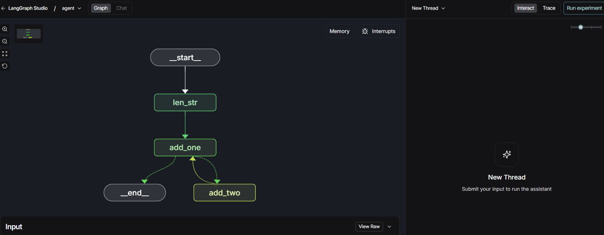

# LangGraph Studio 프로젝트

이 프로젝트는 LangGraph를 사용하여 간단한 워크플로우 그래프를 구현하고 LangGraph Studio에서 시각화하는 예제입니다.

---
## 프로젝트 구조

```
langgraph studio/
├── src/
│   ├── __init__.py
│   ├── graph.py      # 메인 그래프 정의
│   ├── nodes.py      # 그래프 노드 함수들
│   └── states.py     # 상태 정의
├── langgraph.json    # LangGraph Studio 설정
├── pyproject.toml    # 프로젝트 설정
├── requirements.txt  # 의존성 목록
└── README.md        # 이 파일
```

---
## 그래프 구조

이 프로젝트는 다음과 같은 워크플로우를 구현합니다:

1. **len_str 노드**: 입력 문자열의 길이를 계산
2. **add_one 노드**: 이전 결과에 1을 더함
3. **add_two 노드**: 이전 결과에 2를 더함
4. **조건부 분기**: `add_one`에서 결과가 10을 초과하면 종료, 그렇지 않으면 `add_two`로 진행

---
### 그래프 흐름

```css
START → len_str → add_one → [조건부 분기]
                              ↓
                        [결과 > 10] → END
                              ↓
                        [결과 ≤ 10] → add_two → add_one
```

---
## 설치 및 실행

---
### 1. 환경 변수 설정
- `.env.example` 파일을 참고하여 `.env` 파일을 설정하세요. 
- `.env.example` 파일에는 프로젝트에 필요한 환경 변수들이 정의되어 있습니다.

`.env` 파일 예시:
```env
# LangSmith 설정 (필수)
LANGCHAIN_API_KEY="LangSmith API 키"
LANGCHAIN_PROJECT="프로젝트 이름"

```

---
### 2. 의존성 설치

```bash
# 가상환경 활성화 (권장)
uv venv .venv
source .venv/bin/activate  # Linux/Mac
# 또는
.venv\Scripts\activate     # Windows

# 프로젝트 설치
uv pip install -r requirements.txt
uv pip install -e .
```

---
### 3. LangGraph Studio 실행

```bash
langgraph dev
```

실행 후 다음 URL에서 접근할 수 있습니다:
- **Studio UI**: https://smith.langchain.com/studio/?baseUrl=http://127.0.0.1:2024
- **API**: http://127.0.0.1:2024
- **API Docs**: http://127.0.0.1:2024/docs

---
**LangSmith 연동**:
- LangGraph Studio는 자동으로 LangSmith와 연동됩니다
- https://smith.langchain.com 에서 프로젝트 대시보드를 확인할 수 있습니다



---
## 주요 파일 설명

### `src/states.py`
- `State` TypedDict 클래스 정의
- 그래프에서 사용되는 상태 데이터 구조 정의
- `input`, `node_ouput`, `is_stop` 필드 포함

---
### `src/nodes.py`
- 그래프의 각 노드에서 실행되는 함수들
- `len_str()`: 문자열 길이 계산
- `add_one()`: 값에 1을 더하고 10 초과 시 중단 플래그 설정
- `add_two()`: 값에 2를 더함

### `src/graph.py`
- 메인 그래프 정의
- 노드 추가 및 엣지 연결
- 조건부 분기 로직 구현
- `graph` 변수로 컴파일된 그래프 노출

---
## 사용 예시

LangGraph Studio에서 다음과 같이 테스트할 수 있습니다:

1. Studio UI에 접속
2. 그래프 시각화 확인
3. 테스트 입력 제공 (예: "Hello World")
4. 실행 결과 확인

---
**LangSmith 대시보드에서 확인**:
1. https://smith.langchain.com 에서 프로젝트 선택
2. 그래프 실행 히스토리 및 성능 메트릭 확인
3. 각 노드별 실행 시간 및 결과 분석
4. 에러 로그 및 디버깅 정보 확인

---
## 기술 스택

- **LangGraph**: 워크플로우 그래프 프레임워크
- **LangSmith**: 그래프 추적 및 모니터링 플랫폼
- **Python**: 프로그래밍 언어
- **TypedDict**: 타입 힌팅을 위한 데이터 구조
- **LangGraph Studio**: 그래프 시각화 및 테스트 도구

---
## 개발 환경

- Python 3.9+
- LangGraph 0.2.6+
- LangGraph CLI (Studio 실행용)

## 참고문서
- https://langchain-ai.github.io/langgraph/tutorials/langgraph-platform/local-server/ 
- https://github.com/langchain-ai/new-langgraph-project/tree/main
