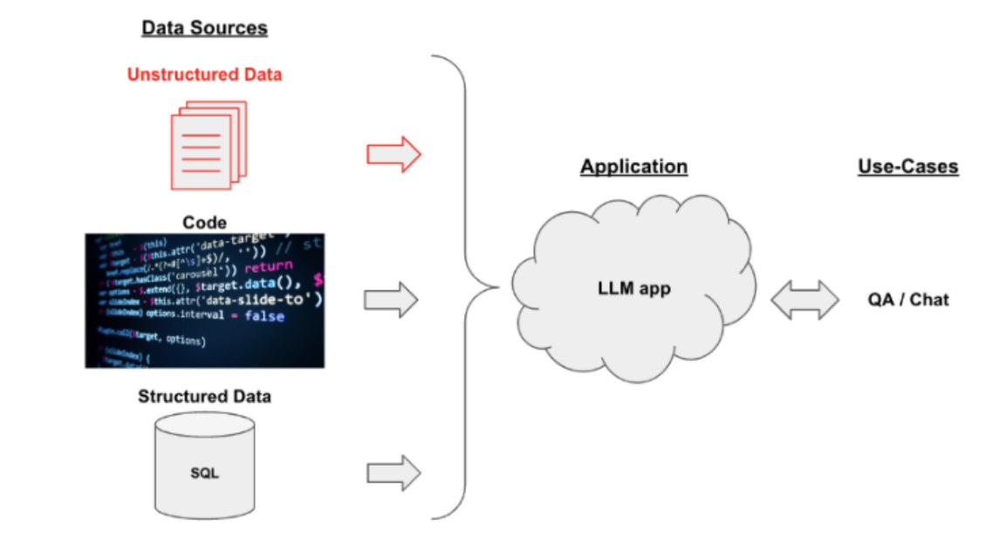

# [LangChain 개요](https://docs.langchain.com/oss/python/langchain/overview)
- LangChain은 LLM을 중심으로 한 애플리케이션 개발 프레임워크입니다.
- LLM이 단순 텍스트 응답을 넘어, 데이터, 툴, 메모리, 외부 시스템과 상호작용할 수 있도록 설계되었습니다.

---
## 주요 역할
- LLM을 구성요소화(Componentization)
- LLM을 외부 지식, API, 데이터베이스와 연결
- 복잡한 대화 흐름을 체인(Chain) 단위로 관리


---
## [LangChaing 장점](https://yongeekd01.tistory.com/92#google_vignette)
- 언어모델 학습시 사용된 데이터 외에 새로운 사용자 데이터를 인식할 수 있게 함
- 여러가지 LLM 언어모델을 선택적으로 사용할 수 있게 함
- 능동적으로 다른 기능과 연동하여 추가적인 결과를 낼 수 있게 함
- 여러 기능 모듈을 체인으로 연결하여 출력을 다른 툴의 입력으로 사용하는 방식으로 기능 확장이 자유로움
- 라이브러리 wrap이 잘되어 있어서 구현이 상대적으로 편함(파이썬, 자바스크립트)

---
# [1. LangChain 응용](https://velog.io/@kofsitho/Langchain-%ED%83%90%EC%83%89-%EA%B3%A0%EA%B8%89-%ED%94%84%EB%A0%88%EC%9E%84%EC%9B%8C%ED%81%AC%EB%A5%BC-%ED%86%B5%ED%95%9C-AI-%ED%98%81%EC%8B%A0)
- 인공지능(AI)이 산업과 일상생활을 빠르게 변화시키고 있는 세상에서 기술 발전의 선두에 선다는 것은 그 어느 때보다 중요합니다.
- 수많은 혁신 중에서 Langchain은 우리가 AI와 상호 작용하고 활용하는 방식에 혁명을 일으킬 준비가 되어 있는 획기적인 프레임워크로 부상하고 있습니다.
- 기술과 지능이 독창적으로 결합된 Langchain은 AI 환경의 등대 역할을 합니다.
  - 이는 언어 모델을 활용하는 방법에 대한 새로운 패러다임을 나타내며 현재 표준을 훨씬 뛰어넘는 기능을 확장합니다.

---


---
## LangChain의 활용 분야
| 분야                                       | 설명                       |
| ---------------------------------------- | ------------------------ |
| **RAG (Retrieval-Augmented Generation)** | 외부 지식 기반 질의응답 시스템        |
| **Multi-turn Chatbot**                   | 대화 맥락 유지형 챗봇             |
| **Data Agent / Query Agent**             | DB, CSV, API 등을 자동 질의    |
| **Task Automation**                      | 워크플로우 자동화, 보고서 생성        |
| **AI Agent**                             | 툴을 사용하여 목표를 스스로 달성하는 시스템 |


---
### 1-1. Data Agent / Query Agent
> DB, CSV, API 등을 자동 질의



---
### [1-2. LangChain with Web Service](https://navan.ai/blog/what-is-langchain/)
> 챗봇 웹 서비스 


---
### [1-3. RAG 프로세스 with LangChain](https://aws.amazon.com/ko/what-is/langchain/)
> 외부 지식 기반 질의응답 시스템


---
# 5. LangChain 주요 구성요소
| 구성요소                        | 설명                                     | 예시                              |
| --------------------------- | -------------------------------------- | ------------------------------- |
| **Prompt Template**         | LLM에 전달할 입력 구조 정의                      | 질의 패턴, 시스템 메시지 등                |
| **Model**                   | LLM 또는 Embedding 모델                    | GPT, Claude, OpenAI Embedding 등 |
| **Output Parser**           | LLM의 응답을 구조화된 형태로 변환                   | JSON, DataFrame, Pydantic 객체 등  |


---
| 구성요소                        | 설명                                     | 예시                              |
| --------------------------- | -------------------------------------- | ------------------------------- |
| **Memory**                  | 대화 기록 저장 및 재활용                         | 대화형 Agent 구현에 사용                |
| **Tool / Function Calling** | 외부 API 또는 함수 실행                        | Calculator, DB Query 등          |
| **Chain**                   | 여러 구성요소를 연결한 실행 파이프라인                  | “입력 → LLM → 출력” 흐름              |
| **Agent**                   | 상황에 맞게 Chain과 Tool을 선택적으로 실행하는 지능형 실행자 | AutoGPT, ReAct 패턴 등             |

---
# 6. LangChain의 동작 구조
- 모든 단계가 모듈형으로 조합 가능
- "단순 질의응답"부터 "복합 워크플로우"까지 확장 가능

```less
User Input → PromptTemplate → Model → OutputParser → Response
                     ↓
                  (Memory)
                     ↓
             (Optional: Tools / Retrievers)
```

---
# 7. LCEL (LangChain Expression Language)
- LCEL은 LangChain에서 **체인(Chain)** 을 선언적으로 구성하기 위한 언어입니다.

---
### 주요 특징
- 선언적 구성: 작업의 순서와 흐름을 명시적으로 정의하여, 복잡한 로직을 간결하게 표현할 수 있습니다.
- 파이프 연산자(|) 지원: Unix의 파이프처럼, 함수의 출력을 다음 함수의 입력으로 전달하여 체인을 구성합니다.

---
> 코드 예제 
```ini
chain = prompt | llm | parser
```


