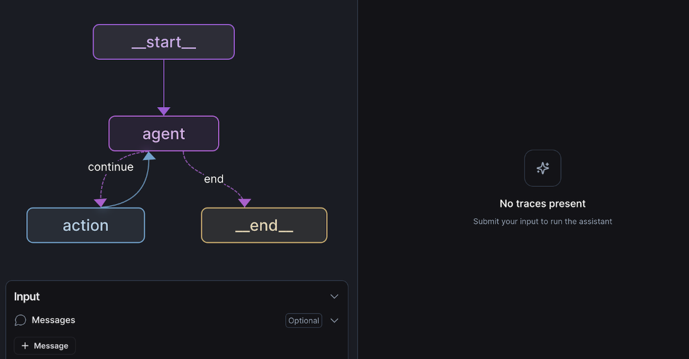
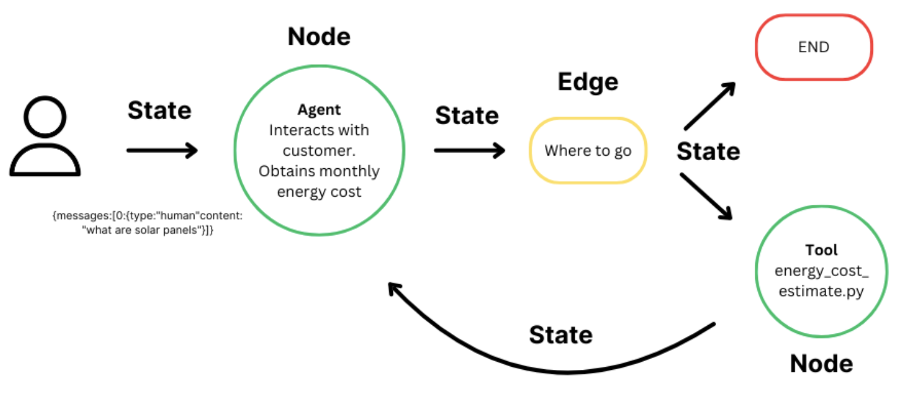
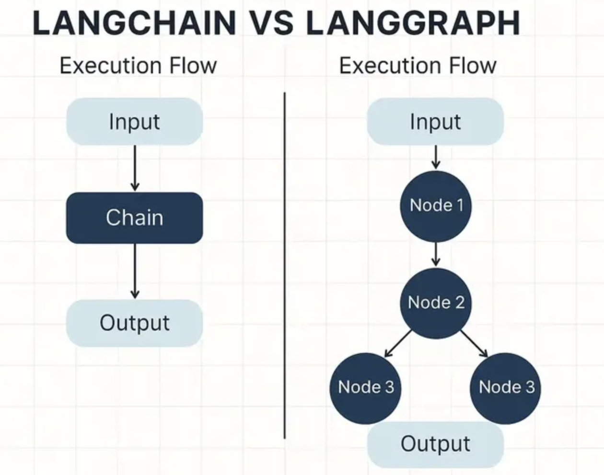

# [LangGraph](https://docs.langchain.com/oss/python/langgraph/overview)
- LangGraph는 LangChain을 확장하여
- "LLM 워크플로우를 그래프 형태로 구성"하도록 만든 프레임워크입니다.

---
## 핵심 아이디어
- 복잡한 체인이나 에이전트를 Node(노드) 와 Edge(엣지) 로 시각화
- 분기, 반복, 병렬 처리 등 제어 흐름을 명시적으로 표현
- Multi-Agent 시스템 구축에 최적화

---


---
# 1. LangGraph 주요 개념
| 개념                       | 설명                                    |
| ------------------------ | ------------------------------------- |
| **Graph**                | 전체 워크플로우 구조 (노드들의 집합)                 |
| **Node (Stateful Node)** | 특정 작업(예: 요약, 검색, 판단 등)을 수행하는 단위       |
| **Edge (Transition)**    | 한 노드의 출력이 다른 노드로 전달되는 흐름              |
| **State**                | 그래프 전체에서 공유되는 데이터 (context, memory 등) |
| **Entry / Exit Node**    | 시작점과 종료점을 정의하는 노드                     |
| **Conditional Edge**     | 조건에 따라 분기하는 흐름 (if/else 구조)           |

---


---
# 2. LangChain vs LangGraph 비교
| 항목         | LangChain       | LangGraph         |
| ---------- | --------------- | ----------------- |
| **구조**     | 순차적 체인 기반       | 그래프 기반 (노드/엣지)    |
| **복잡도**    | 단일 흐름 중심        | 분기, 병렬, 반복 구조 가능  |
| **주요 사용처** | 단일 LLM 파이프라인    | 멀티 에이전트, 복합 워크플로우 |
| **코드 스타일** | LCEL (함수형 체인)   | 선언형 그래프 구조        |
| **상태 관리**  | 제한적 (Memory 중심) | 전역 상태(State) 관리   |
| **예시**     | 단일 챗봇           | 협력형 Agent 시스템     |

---
## LangChain과 LangGraph의 관계
- LangGraph는 LangChain 위에서 동작
- LangChain이 제공하는 “Chain”, “Tool”, “Prompt” 등을 노드 단위로 구성
- LangGraph는 이를 워크플로우(Flow) 로 연결하고 관리

```ini
LangChain = 기능 단위의 모듈
LangGraph = 기능을 연결한 전체 시스템의 설계도

```

---


---
# 3. LangGraph의 대표 사용 사례
| 사례                     | 설명                                 |
| ---------------------- | ---------------------------------- |
| **Multi-Agent 협업 시스템** | 여러 Agent가 역할 분담 (예: 리서처, 라이터, 에디터) |
| **Decision Flow 모델링**  | 조건에 따라 다른 LLM 호출 경로 선택             |
| **RAG Pipeline 최적화**   | 검색-요약-생성 단계를 병렬화                   |
| **LLM 기반 워크플로우 자동화**   | 인간의 승인 단계를 포함한 복잡한 프로세스 표현         |
